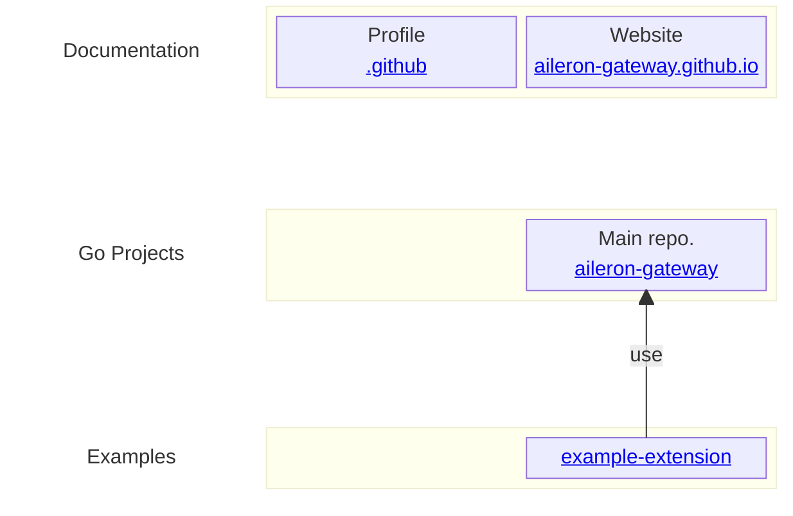

# :tada: Welcome to the AILERON Gateway Community :tada:

> [!NOTE]
> **AILERON Gateway — secure, high-performance API Gateway for cloud-native enterprise systems.**

## Documentations

- [Website](https://aileron-gateway.github.io/)
- [Design Docs](https://github.com/aileron-gateway/aileron-gateway/tree/main/docs)
- [Go Docs](https://pkg.go.dev/github.com/aileron-gateway/aileron-gateway)

## Repositories

| Repository | Content |
| - | - |
| [aileron-gateway](https://github.com/aileron-gateway/aileron-gateway) | Main development repository. |
| [aileron-gateway.github.io](https://github.com/aileron-gateway/aileron-gateway.github.io) | Website resources. |
| [example-extension](https://github.com/aileron-gateway/example-extension) | Example to extend the gateway. |
| [.github](https://github.com/aileron-gateway/.github) | Organization profiles. |

**Repository overview.**

